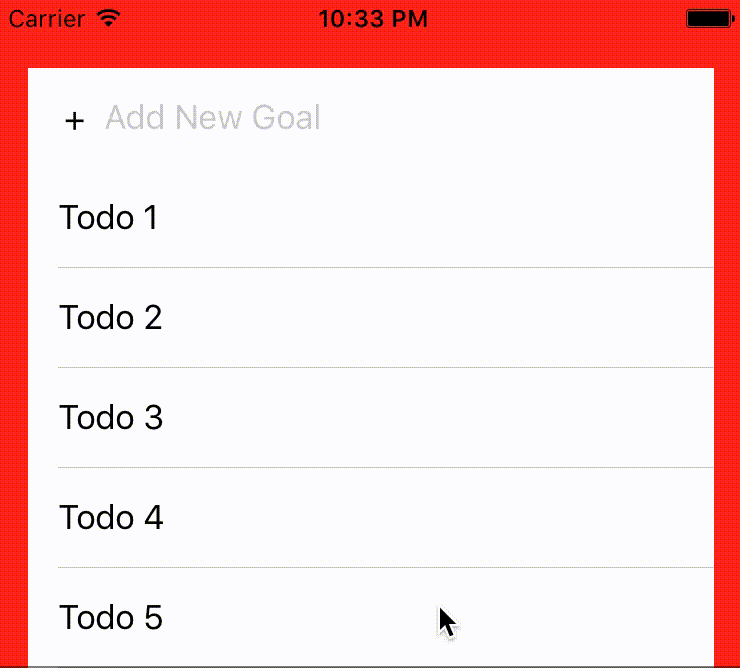
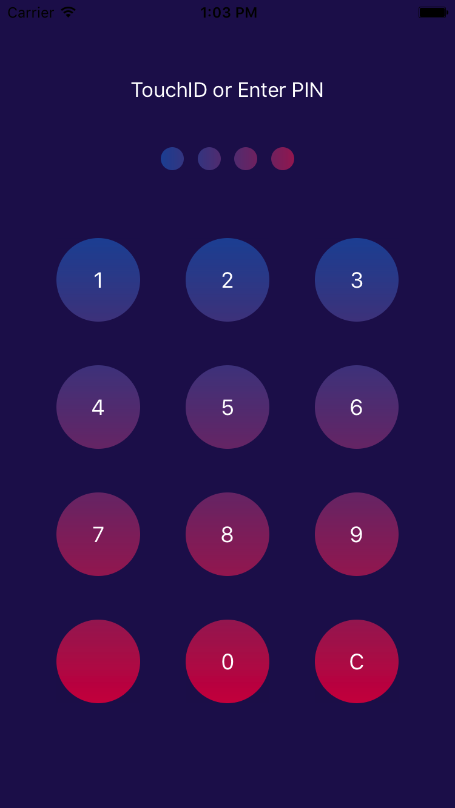

# Dribble Challenges

A series of small projects to implement interesting UI designs on Dribble.

## Animated Todo list

I used custom transitions based on view snapshots to give the appearance of the cells transitioning from header to table body and off again. This was preferable as the tableview has strong ideas where a cell should be positioned which is in conflict with the need to animate.

[Inspiration](https://dribbble.com/shots/2589690-Be-amazing-today) Anna Gerasymenko

## Dial pad View

Under pinned by a collection view and standard flow layout, I added some display logic for the cell gradients and layout constraints to ensure a fixed number of cells remain on screen but also fill the space available. 
The same view can then also be customised and used for the pin display.

[Inspiration](https://dribbble.com/shots/3363836-Splash-and-Passcode-screens) Alexander Zaytsev
